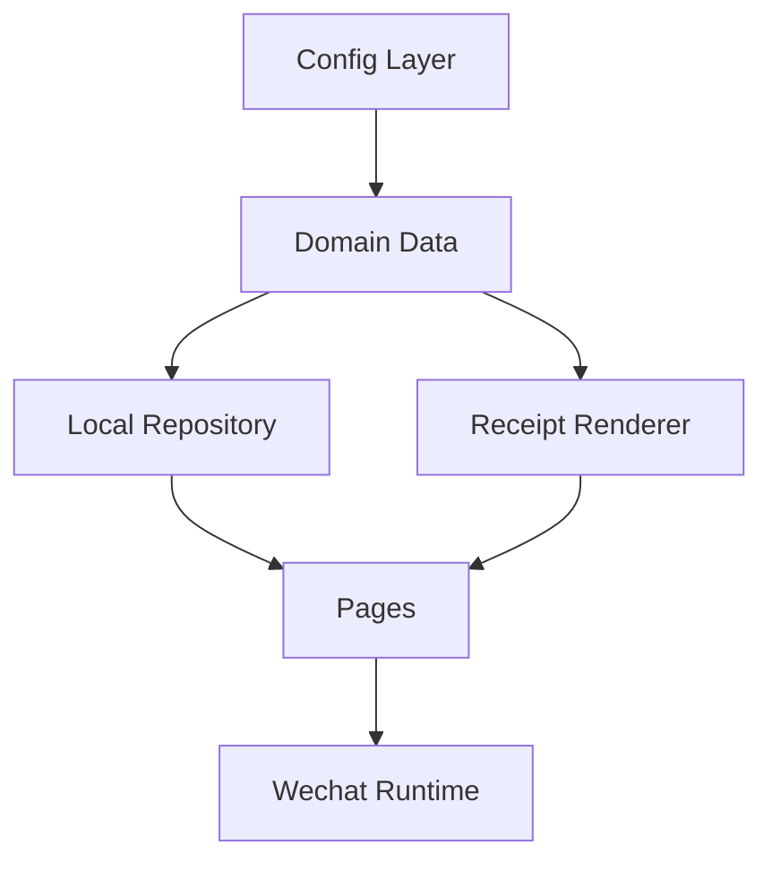
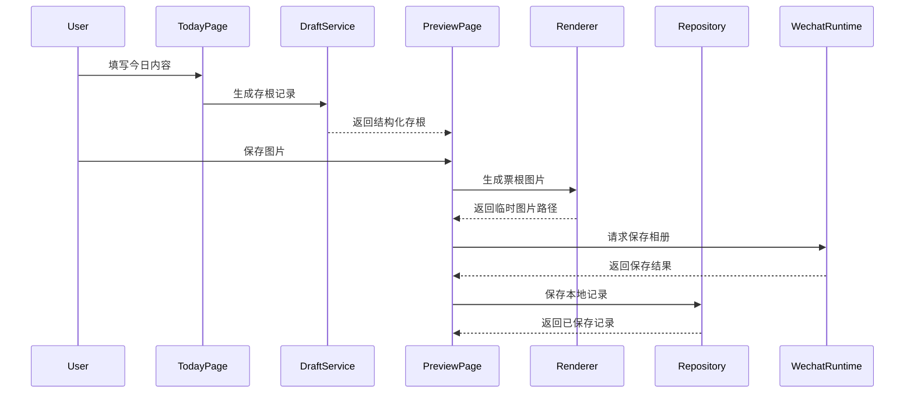
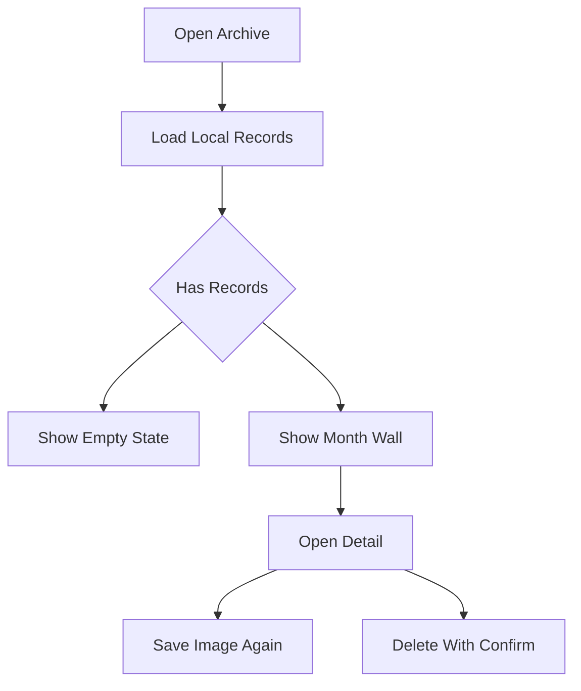

# Design Document

## Overview

V1 小程序把已经确认的「今日存根」产品方案落地为一个本地可运行的微信小程序。用户在今日生成页记录状态、情绪、能量、一句话和可选生活痕迹，进入票根预览后保存图片，并把结构化存根留在本地存档墙中。

设计重点是让 V1 尽快形成稳定闭环：页面复刻现有原型气质，数据结构为未来云同步预留，票根预览与导出保持一致。系统不引入后端、账号、付费或 AI。

### Goals

- 交付原生微信小程序 V1 主流程：今日生成、票根预览、保存图片、本地存档、详情、设置隐私。
- 建立稳定的本地数据模型、配置库和 Canvas 渲染边界。
- 保持产品温柔、克制、有生活凭证感，同时避免记账、心理诊断和社交压力。

### Non-Goals

- 不实现云同步、登录、会员、公开社区、评论、排行、AI 文案生成。
- 不实现消费总额、预算、分类统计或趋势图。
- 不实现复杂主题商店、自定义贴纸、自定义模块市场或运营后台。

## Boundary Commitments

### This Spec Owns

- V1 原生微信小程序工程骨架和页面路由。
- 今日生成、票根预览、相册保存、本地存档、详情、设置隐私的用户可见行为。
- 本地配置库：状态、短语、印章、小物件、主题、生活模块定义。
- 本地数据模型：草稿状态、存根记录、生活模块、情绪价值资产引用。
- 本地存储读写、删除、清空、按日期归档。
- 票根预览和 Canvas 图片渲染的内容顺序、主题规则、中文换行与动态高度。

### Out of Boundary

- 云端数据同步、账号体系、手机号登录、会员付费和运营后台。
- AI 生成、心理咨询建议、公开社区和互动体系。
- 财务统计、预算提醒、消费分类和记账报表。
- 发布审核材料、隐私协议法律文本最终稿和小程序后台配置。

### Allowed Dependencies

- 微信小程序原生运行时、页面路由、本地存储、Canvas、相册保存和授权能力。
- 本仓库已有产品文档、静态原型和 UI 概念图。
- 本地 JS 配置文件和本地静态资源。

### Revalidation Triggers

- `StubRecord`、`LifeModule` 或主题配置字段发生破坏性变化。
- 票根布局顺序、保存图片尺寸或 Canvas 渲染策略变化。
- 引入云同步、登录或远程文案配置。
- 将小花费扩展为金额、预算、分类或统计能力。
- 微信小程序保存图片或 Canvas API 在实现中发现平台限制。

## Architecture

### Architecture Pattern & Boundary Map

Selected pattern: 本地分层小程序。配置、领域数据、存储、渲染、页面按依赖方向组织，页面只编排用户交互，不直接拼接票根绘制细节。



Dependency direction: `config` 和 `models` 是最底层；`services` 依赖配置和模型；`components` 依赖配置、模型和服务输出；`pages` 组合组件与服务；任何底层模块不得反向依赖页面。

### Technology Stack

| Layer | Choice / Version | Role in Feature | Notes |
|-------|------------------|-----------------|-------|
| Runtime | 微信小程序原生运行时 | 页面、路由、Canvas、相册保存、本地存储 | 实现阶段用微信开发者工具验证 |
| Language | JavaScript with JSDoc contracts | 页面逻辑、服务、配置 | 不引入 TypeScript 编译链，保留明确类型注释 |
| UI | WXML / WXSS | 复刻 V1 原型页面和组件 | 移动端优先 |
| Data | 微信本地存储 | 保存 `StubRecord` 历史记录 | V1 不上传云端 |
| Rendering | 小程序 Canvas | 生成可保存票根图片 | 固定设计宽度，动态高度 |

## File Structure Plan

### Directory Structure

```text
project.config.json                         # 微信开发者工具项目配置
miniprogram/
├── app.js                                  # App Shell：启动、全局默认状态
├── app.json                                # 页面路由和窗口配置
├── app.wxss                                # 全局视觉变量和基础样式
├── assets/                                 # 本地极简图形或静态资源
├── config/
│   ├── statuses.js                         # 状态卡、情绪选项、能量展示配置
│   ├── life-modules.js                     # 默认生活痕迹模块配置
│   ├── phrases.js                          # 打开、状态、判定、保存、空态短语库
│   ├── stamps.js                           # 小印章配置
│   ├── objects.js                          # 小物件配置
│   └── themes.js                           # 三套票根主题配置
├── models/
│   └── stub-record.js                      # JSDoc 数据契约和默认记录工厂
├── services/
│   ├── draft-service.js                    # 草稿归一化、随机候选、生成记录
│   ├── stub-repository.js                  # 本地存储、查询、删除、清空
│   ├── receipt-layout.js                   # 票根布局计算、换行和高度计算
│   ├── receipt-renderer.js                 # Canvas 绘制和图片生成
│   └── image-export-service.js             # 相册授权、保存图片、失败重试入口
├── components/
│   ├── status-picker/                      # 状态选择组件
│   ├── emotion-meter/                      # 情绪余额组件
│   ├── energy-battery/                     # 能量值组件
│   ├── life-module-editor/                 # 生活痕迹添加、移除、折叠
│   ├── receipt-preview/                    # 页面预览票根
│   ├── stub-card/                          # 存档墙列表卡片
│   └── privacy-panel/                      # 本地隐私说明与清空确认
├── pages/
│   ├── today/                              # 今日生成页
│   ├── preview/                            # 票根预览和保存页
│   ├── archive/                            # 存档墙
│   ├── detail/                             # 存根详情
│   └── settings/                           # 设置隐私
└── utils/
    ├── date.js                             # 日期、编号、月份分组
    ├── id.js                               # 本地唯一 ID 生成
    └── text.js                             # 文本清洗、长度限制、显示兜底
```

### Modified Files

- `README.md` — 在正式开发开始后补充小程序工程入口和运行方式。
- `.gitignore` — 如微信开发者工具生成本机私有配置，应忽略对应私有文件。

## System Flows

### Generate And Save Flow



### Archive Flow



## Requirements Traceability

| Requirement | Summary | Components | Interfaces | Flows |
|-------------|---------|------------|------------|-------|
| 1.1, 1.2, 1.3, 1.4 | 今日入口、最短路径和复访入口 | Today Page, Draft Service, Stub Repository | Draft state, record query | Generate And Save Flow |
| 2.1, 2.2, 2.3, 2.4, 2.5 | 状态、情绪、能量和用户表达 | Today Page, Status Picker, Emotion Meter, Energy Battery, Draft Service | Draft state, StubRecord | Generate And Save Flow |
| 3.1, 3.2, 3.3, 3.4, 3.5 | 可选生活痕迹模块 | Life Module Editor, Draft Service, Receipt Preview, Receipt Renderer | LifeModule | Generate And Save Flow |
| 4.1, 4.2, 4.3, 4.4, 4.5, 4.6 | 短语、印章、小物件 | Config Library, Draft Service, Receipt Preview | phraseId, stampId, objectId | Generate And Save Flow |
| 5.1, 5.2, 5.3, 5.4 | 票根预览和主题 | Preview Page, Receipt Preview, Receipt Layout, Receipt Renderer | ThemeConfig, layout blocks | Generate And Save Flow |
| 6.1, 6.2, 6.3, 6.4, 6.5 | 保存图片和授权反馈 | Preview Page, Image Export Service, Receipt Renderer | export result | Generate And Save Flow |
| 7.1, 7.2, 7.3, 7.4, 7.5, 7.6 | 本地存档墙和详情 | Stub Repository, Archive Page, Detail Page, Stub Card | record query, delete | Archive Flow |
| 8.1, 8.2, 8.3, 8.4, 8.5 | 设置隐私和边界 | Settings Page, Privacy Panel, App Shell | clear records | Archive Flow |

## Components and Interfaces

| Component | Domain | Intent | Req Coverage | Key Dependencies | Contracts |
|-----------|--------|--------|--------------|------------------|-----------|
| App Shell | Runtime | 小程序启动、路由、全局样式 | 1.1, 8.5 | Wechat Runtime P0 | State |
| Config Library | Config | 提供状态、短语、印章、小物件、主题和生活模块 | 3.1, 4.1, 4.3, 5.2 | None | Service |
| Draft Service | Domain | 归一化草稿并生成稳定存根记录 | 1.2, 2.1, 2.4, 3.5, 4.5 | Config Library P0 | Service |
| Stub Repository | Data | 本地存根记录持久化和查询 | 1.3, 7.1, 7.5, 8.2 | Wechat Storage P0 | Service |
| Receipt Layout | Rendering | 计算票根文本行、分区和高度 | 5.1, 5.3, 5.4 | StubRecord P0 | Service |
| Receipt Renderer | Rendering | 将存根记录绘制成图片 | 5.1, 6.2, 6.5 | Receipt Layout P0 | Service |
| Image Export Service | Platform | 相册授权、保存图片和失败处理 | 6.1, 6.2, 6.3, 6.4 | Wechat Runtime P0 | Service |
| Today Page | UI | 今日生成与最短路径 | 1.1, 1.2, 2.1, 3.1, 4.1 | Draft Service P0 | State |
| Preview Page | UI | 票根确认、换主题、保存和入档 | 5.1, 5.2, 6.1, 6.2 | Renderer P0, Repository P0 | State |
| Archive Page | UI | 月份、日期和历史存根列表 | 7.2, 7.3, 7.6 | Repository P0 | State |
| Detail Page | UI | 完整票根、原始字段、再次保存、删除 | 7.4, 7.5 | Repository P0, Renderer P1 | State |
| Settings Page | UI | 本地隐私说明和清空数据 | 8.1, 8.2, 8.3, 8.4 | Repository P0 | State |

### Domain And Config

#### Config Library

**Responsibilities & Constraints**

- 提供本地静态配置，不依赖远程接口。
- 配置 ID 必须稳定，历史记录保存 ID 后可回看。
- 小花费模块配置不得包含总额、预算、分类统计等字段。

**Service Interface**

```typescript
interface ConfigLibrary {
  getStatuses(): StatusOption[];
  getLifeModuleDefinitions(): LifeModuleDefinition[];
  getPhrases(scene: PhraseScene, statusId?: string): PhraseOption[];
  getTheme(themeId: ThemeId): ThemeConfig;
  getStamp(stampId: string): StampOption;
  getObject(objectId: string): ObjectOption;
}
```

#### Draft Service

**Responsibilities & Constraints**

- 接收页面草稿，生成可预览和可保存的 `StubRecord`。
- 当用户没有填写自己的句子时，明确使用候选短语兜底。
- 随机短语、印章、小物件一旦进入记录，保存 ID 和展示文本。

**Service Interface**

```typescript
interface DraftService {
  createInitialDraft(today: string): DraftState;
  normalizeDraft(draft: DraftState): NormalizedDraft;
  generateRecord(draft: DraftState, options: GenerateOptions): StubRecord;
  refreshPhrase(draft: DraftState, scene: PhraseScene): DraftState;
}
```

### Data

#### Stub Repository

**Responsibilities & Constraints**

- 以本地存储为唯一 V1 数据来源。
- 支持同一天多条记录。
- 清空和删除必须由页面先完成用户确认。

**Service Interface**

```typescript
interface StubRepository {
  listRecords(): Promise<StubRecord[]>;
  listRecordsByMonth(month: string): Promise<StubRecord[]>;
  getRecord(id: string): Promise<StubRecord | null>;
  saveRecord(record: StubRecord): Promise<StubRecord>;
  deleteRecord(id: string): Promise<void>;
  clearRecords(): Promise<void>;
}
```

### Rendering

#### Receipt Layout

**Responsibilities & Constraints**

- 将 `StubRecord` 转换为票根布局块。
- 统一处理中文换行、最大行数、动态高度和生活模块顺序。
- 不为未启用生活模块预留空位。

**Service Interface**

```typescript
interface ReceiptLayoutService {
  buildLayout(record: StubRecord, theme: ThemeConfig): ReceiptLayout;
  wrapText(input: TextWrapInput): TextLine[];
}
```

#### Receipt Renderer

**Responsibilities & Constraints**

- 使用固定设计宽度绘制票根图片。
- 输出清晰完整的临时图片路径。
- 导出内容必须与预览字段顺序一致。

**Service Interface**

```typescript
interface ReceiptRenderer {
  renderToImage(record: StubRecord, theme: ThemeConfig): Promise<RenderResult>;
}
```

#### Image Export Service

**Responsibilities & Constraints**

- 保存图片时才处理相册权限。
- 区分授权拒绝、图片生成失败和保存失败。
- 返回页面可展示的结果，不直接吞掉失败。

**Service Interface**

```typescript
interface ImageExportService {
  saveReceiptImage(record: StubRecord, theme: ThemeConfig): Promise<ImageExportResult>;
}
```

### UI Pages

#### Today Page

- 组合状态、情绪、能量、文本输入、生活模块、轻提示和生成入口。
- 生成按钮在最短路径下可用：只选择状态也能生成。
- 当天已有记录时展示进入存档或当天记录的入口。

#### Preview Page

- 展示完整票根预览，支持换主题、换一句、保存图片和存入今天。
- 保存成功弹层显示温柔反馈和分享方向。
- 授权失败状态提供重试路径。

#### Archive Page

- 按月份显示有记录日期和存根列表。
- 同一天多条记录需要有可识别表达。
- 空态低压力引导用户生成第一张。

#### Detail Page

- 展示完整票根和原始字段。
- 支持再次保存图片和删除。
- 删除前由页面显示确认。

#### Settings Page

- 说明记录默认保存在本机，不上传云端。
- 提供清空本地数据入口，并二次确认。
- 显示版本和反馈入口。

## Data Models

### Domain Model

```typescript
type SyncStatus = "local_only" | "synced" | "sync_failed";
type ThemeId = "thermal_default" | "night_stub" | "exhibit_ticket";
type PhraseScene = "opening" | "status_selected" | "verdict" | "saved" | "archive_empty";

interface LifeModule {
  id: "sleep" | "drink" | "small_spend" | "little_joy" | string;
  label: string;
  value: string;
  enabled: boolean;
}

interface StubRecord {
  id: string;
  version: number;
  date: string;
  statusId: string;
  statusLabel: string;
  emotionBalance: number;
  energy: number;
  selfSentence: string;
  selfSentenceSource: "user" | "fallback_phrase";
  proof: string;
  optionalNote: string;
  lifeModules: LifeModule[];
  openingPhraseId: string;
  statusPhraseId: string;
  verdictId: string;
  verdict: string;
  stampId: string;
  objectId: string;
  themeId: ThemeId;
  createdAt: number;
  updatedAt: number;
  syncStatus: SyncStatus;
}
```

### Data Invariants

- `id` 全局唯一，同一天可以有多条记录。
- `version` 初始为 `1`。
- `syncStatus` 在 V1 默认为 `local_only`。
- `lifeModules` 只保存启用或曾被用户编辑后需要保留的模块；渲染时只展示 `enabled = true` 且有内容的模块。
- `small_spend` 不保存金额合计、预算、分类统计字段。
- 历史记录展示使用保存时的 `verdict`、`stampId`、`objectId` 和 `themeId`。

## Error Handling

### Error Categories and Responses

- **输入为空**: 状态缺失时提示选择状态；用户句子为空时允许用候选短语兜底。
- **图片生成失败**: 保留预览内容，展示重试按钮。
- **相册授权拒绝**: 展示权限说明和再次尝试路径，不丢失当前记录。
- **本地存储失败**: 告知用户保存到存档失败，可再次尝试保存。
- **记录不存在**: 详情页回退到存档墙并提示记录已不存在。

## Testing Strategy

### Unit Tests

- Draft Service: 只选择状态时能生成有效记录；用户句子为空时使用兜底短语。
- Stub Repository: 新增、读取、按月查询、删除、清空流程。
- Receipt Layout: 中文长句换行、生活模块顺序、无模块时不占位。
- Config Library: 所有默认 ID 可被查询，历史引用不失效。

### Integration Tests

- 今日生成到预览：草稿字段同步到票根。
- 预览保存：渲染成功后保存相册并写入本地历史。
- 存档详情：历史记录能打开完整详情并再次保存。
- 删除记录：详情删除后存档墙刷新。

### Manual WeChat DevTools QA

- 常见手机尺寸下今日页、预览页、存档墙、详情页、设置页无文本遮挡。
- 相册授权同意、拒绝、重试路径可用。
- 三套主题导出图片清晰完整。
- 同一天多条记录可识别。
- 清空本地数据后存档墙显示空态。

## Security And Privacy Considerations

- V1 记录只保存在本地，不上传远程服务。
- 不在打开小程序时请求相册权限，只在用户保存图片时触发。
- 清空本地数据前必须二次确认。
- 不采集手机号、真实身份、定位或通讯录。

## Performance And Scalability

- 今日生成页首屏应轻量，不依赖远程请求。
- 票根图片生成在用户主动保存时执行，避免每次输入都重绘 Canvas。
- 存档墙按月份读取和分组，避免历史记录增长后一次性渲染过多卡片。
- 数据结构保留版本字段，便于后续迁移。
